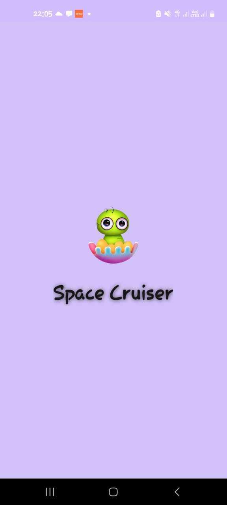
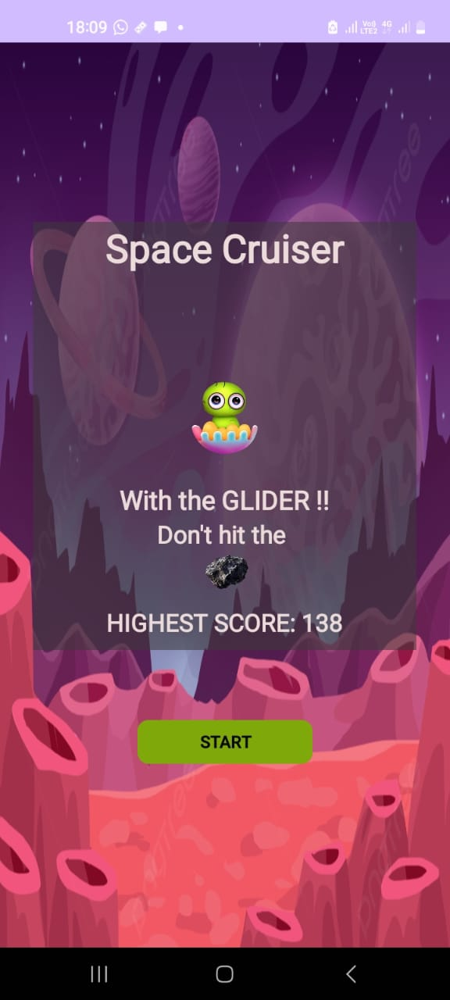
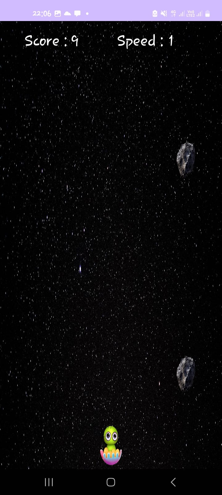
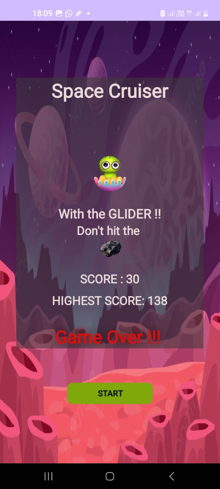

# Space Cruiser

Space Cruiser is a simple yet engaging space-themed game where players control the character "Glider", an alien navigating through space while avoiding asteroids. The goal is to steer the Glider safely through space, avoiding collisions with approaching asteroids to earn points.

## Screenshots

  

    
  

  

    
  

  

    
  

  

    
  

## Instructions

### Objective
Navigate the Glider through space safely while avoiding oncoming asteroids.

### Controls
- To move the Glider left, tap the left side of the screen.
- To move the Glider right, tap the right side of the screen.
- To move the Glider to the center, tap the center of the screen.
- The Glider will automatically move forward through space; players only need to control its horizontal movement.

## Gameplay
- At the start of the game, the Glider appears navigating through space.
- Asteroids appear from the top of the screen and move downward toward the Glider, with their speed increasing for every 10 points scored.
- Use the controls mentioned above to maneuver the Glider.

### Scoring
- Points are awarded based on the number of asteroid collisions avoided since the start of gameplay; the more asteroids avoided, the higher the score.
- To achieve the highest score, navigate the Glider through space while avoiding collisions for as long as possible.

### Speed
- At the start of the game, the Glider's initial speed is set to 1.
- With each 10 points scored by the player, the speed of obstacles increments by 1 point.

## Game Over
- The game ends immediately when the Glider collides with an asteroid, displaying the player's score and the highest score achieved.
- Players have the opportunity to restart a new game.

### Restart
- To restart a new game, click on the start button displayed on the screen.
